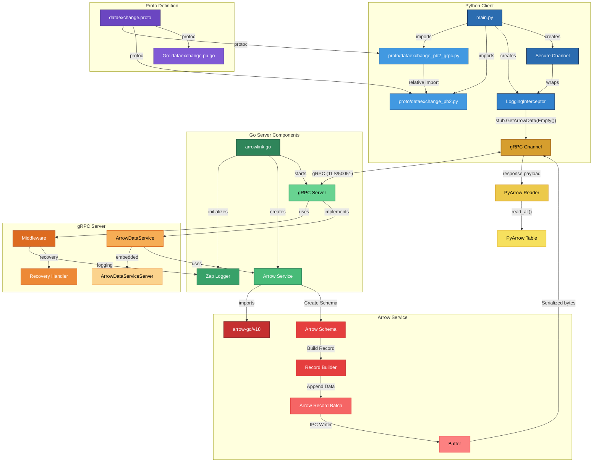

# ArrowLink

ArrowLink is a demonstration of using Apache Arrow for efficient data exchange between a Go-based gRPC server and a Python client. It leverages Arrow's zero-copy serialization and gRPC streaming to transfer structured data at high speeds.

## Overview



## Key Features

- 🚀 gRPC-based communication between Go and Python
- 🔄 Apache Arrow for efficient binary data exchange
- 📡 Streaming support for handling large datasets
- 🏎 High-speed, zero-copy serialization for optimal performance
- 🔧 Extensible architecture for integrating with real-world data systems

## Performance Benchmarks

ArrowLink demonstrates exceptional performance when handling large datasets. Below are the results from our benchmark tests:

| Rows      | Size (KB) | Generation Time (ms) | Serialization Time (ms) | Total Time (ms) |
| --------- | --------- | -------------------- | ----------------------- | --------------- |
| 1,000     | 29        | 0.77                 | 0.17                    | 0.95            |
| 250,750   | 7,132     | 27.83                | 3.29                    | 31.12           |
| 500,500   | 14,236    | 35.62                | 3.51                    | 39.14           |
| 750,250   | 21,339    | 45.42                | 6.50                    | 51.93           |
| 1,000,000 | 28,443    | 52.50                | 3.58                    | 56.09           |

These results highlight ArrowLink's ability to:

- Process 1 million rows in just 56ms
- Maintain efficient serialization even as data size increases
- Achieve compression ratios that keep data sizes manageable

## Use Cases

ArrowLink is useful in scenarios where high-performance, structured data exchange is required across multiple programming environments. Some practical applications include:

1. Real-Time Data Pipelines
   - Send structured data from Go-based ingestion services to Python-based analytics engines.
   - Example: Streaming sensor data from an IoT device to a Python ML model.
2. Machine Learning Inference
   - Use Go to handle API requests while forwarding Arrow-encoded data to a Python ML inference engine.
   - Example: A recommendation system where Go receives user queries and Python processes the embeddings.
3. ETL & Data Processing Workflows
   - Move large datasets between Go and Python without expensive JSON serialization/deserialization.
   - Example: A Go service collects logs and sends them to Python for batch processing with Pandas.
4. Vector Search & AI Pipelines
   - Utilize Arrow for fast embedding transmission between Go-based search engines and Python-based vector search libraries (e.g., FAISS, Annoy).
   - Example: A document similarity engine where Go serves the front-end API and Python handles vector indexing.

## Setup

### Install the dependencies

```bash
pip install -r python/requirements.txt
```

### Run the server

```bash
go run arrowlink.go
```

### Run the client

```bash
python python/main.py
```

### Run the benchmark

```bash
go run cmd/benchmark/main.go --min 1000 --max 1000000 --steps 5
```

### Run the dashboard

```bash
streamlit run python/dashboard.py
```

## Sample Output

```bash
pyarrow.Table
id: int64 not null
value: double not null
----
id: [[1]]
value: [[3.14]]
```

## Docker Support

You can also run ArrowLink using Docker Compose:

```bash
docker-compose up
```

This will start both the server and the dashboard, making them accessible at:

- gRPC Server: localhost:50051
- Dashboard: <http://localhost:8501>
