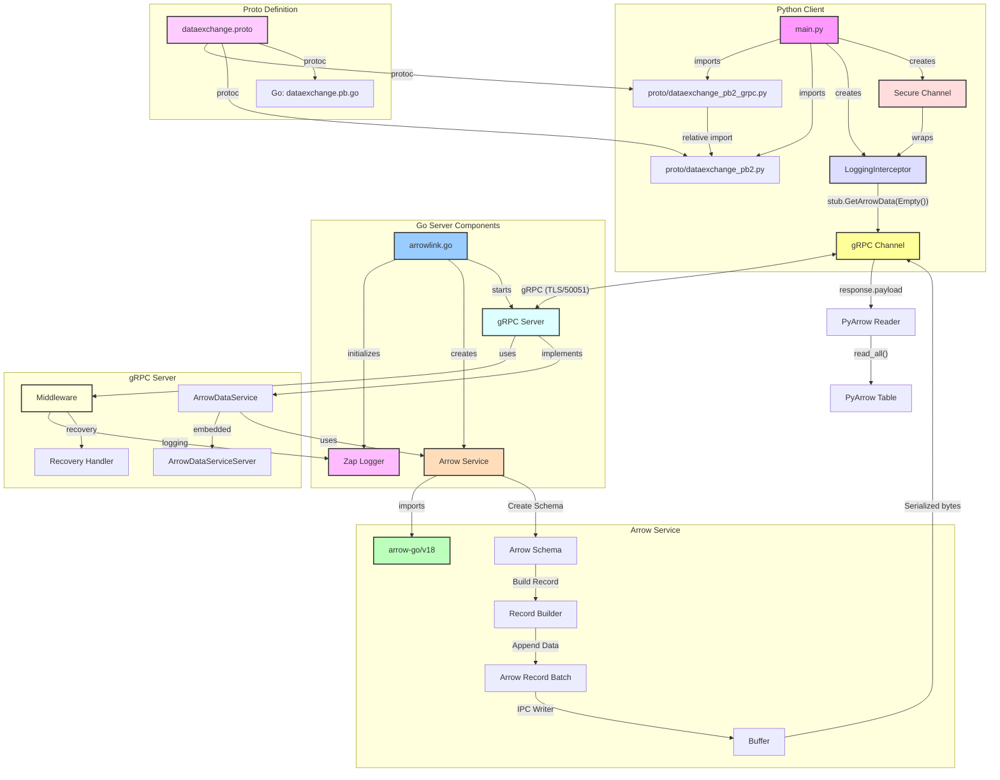

# ArrowLink

ArrowLink is a demonstration of using Apache Arrow for efficient data exchange between a Go-based gRPC server and a Python client. It leverages Arrow’s zero-copy serialization and gRPC streaming to transfer structured data at high speeds.

## Overview


## Architecture



## Key Features

- 🚀 gRPC-based communication between Go and Python
- 🔄 Apache Arrow for efficient binary data exchange
- 📡 Streaming support for handling large datasets
- 🏎 High-speed, zero-copy serialization for optimal performance
- 🔧 Extensible architecture for integrating with real-world data systems

## Use Cases

ArrowLink is useful in scenarios where high-performance, structured data exchange is required across multiple programming environments. Some practical applications include:

1. Real-Time Data Pipelines
   - Send structured data from Go-based ingestion services to Python-based analytics engines.
   - Example: Streaming sensor data from an IoT device to a Python ML model.
2. Machine Learning Inference
   - Use Go to handle API requests while forwarding Arrow-encoded data to a Python ML inference engine.
   - Example: A recommendation system where Go receives user queries and Python processes the embeddings.
3. ETL & Data Processing Workflows
   - Move large datasets between Go and Python without expensive JSON serialization/deserialization.
   - Example: A Go service collects logs and sends them to Python for batch processing with Pandas.
4. Vector Search & AI Pipelines
   - Utilize Arrow for fast embedding transmission between Go-based search engines and Python-based vector search libraries (e.g., FAISS, Annoy).
   - Example: A document similarity engine where Go serves the front-end API and Python handles vector indexing.

## Setup

### Install the dependencies

```bash
pip install -r python/requirements.txt
```

### Run the server

```bash
go run arrowlink.go
```

### Run the client

```bash
python python/main.py
```

## Sample Output

```bash
pyarrow.Table
id: int64 not null
value: double not null
----
id: [[1]]
value: [[3.14]]
```
